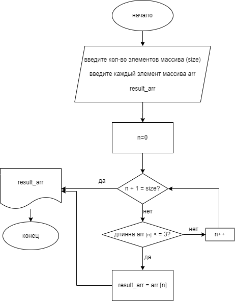

# Итоговая контрольная работа по основному блоку

Необходимо решить задачу:
 
> Написать программу, которая из имеющегося массива строк формирует новый массив из строк, длина которых меньше, либо равна 3 символам. Первоначальный массив можно ввести с клавиатуры, либо задать на старте выполнения алгоритма. При решении не рекомендуется пользоваться коллекциями, лучше обойтись исключительно массивами.

## Шаг 1. Составить схему




## Шаг 2. Продумать алгоритм
### Ввод данных
Я решила сделать так, чтобы пользователь вводил данные: размер массива,и затем каждый элемент этого массива в ручную.
При помощи цикла ```for``` вычисляем количество элементов в новом массиве.
### Решение 
Я использовала метод ```ArrWithLessThen3Symbols``` для заполнения итогового массива.

```
string [] ArrWithLessThen3Symbols(string [] arr1, string [] arr2)
{
    int i = 0;
    for (int j = 0;  j < arr1.Length; j++)
        {
            if (arr1[j].Length <= 3)
            {
                arr2[i] = arr1[j]; 
                i++;
            }
        }     
    return arr2;
}
```
## Шаг 3. Оформить работу
[x] 1. Создать репозиторий на GitHub

[x] 2. Нарисовать блок-схему алгоритма (можно обойтись блок-схемой основной содержательной части, если вы выделяете её в отдельный метод)

[ ] 3. Снабдить репозиторий оформленным текстовым описанием решения (файл README.md)

[x] 4. Написать программу, решающую поставленную задачу

[ ] 5. Использовать контроль версий в работе над этим небольшим проектом (не должно быть так, что всё залито одним коммитом, как минимум этапы 2, 3, и 4 должны быть расположены в разных коммитах)

# About this repository
It was created  to solve a task: 
write a program that forms a new array (from an existing array) of elements whose length is less or equal to 3  symbols. An example:

[“Hello”, “2”, “world”, “:-)”] → [“2”, “:-)”]

[“1234”, “1567”, “-2”, “ science”] → [“-2”]

[“Russia”, “Denmark”, “Kazan”] → []